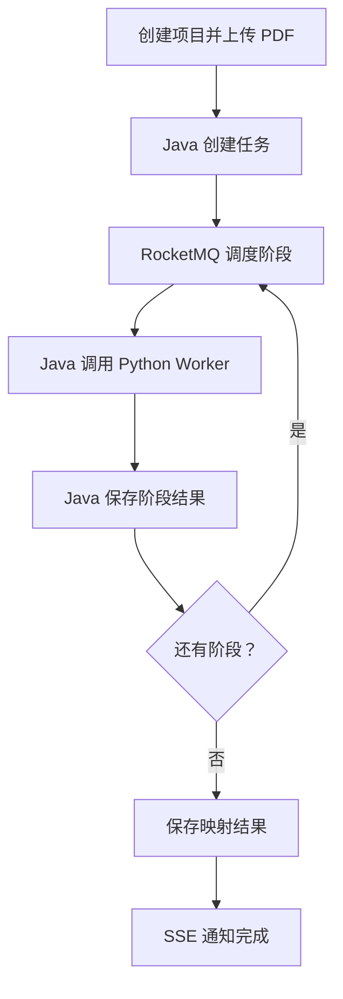

基于我刚刚检查的 [PaperPilot 仓库](https://github.com/cheems908/PaperPilot)，建议你把开发过程拆成：

> 7 个阶段、约 35 张任务卡；严格按“接口契约 → Java 后端 → Python Worker → 前端”的顺序推进。

当前仓库的实际状态是：

* [Java 后端](https://github.com/cheems908/PaperPilot/tree/master/paperpilot-api)只有启动类、依赖和配置，没有 Controller、Service、Mapper、数据库迁移或 MQ 消费者。
* [Python Worker](https://github.com/cheems908/PaperPilot/tree/master/paperpilot-agent)已经有 Paper、Code、Mapping、Env Agent 文件，但全部是 stub。
* [pipeline.py](https://github.com/cheems908/PaperPilot/blob/master/paperpilot-agent/agents/pipeline.py)只是串行占位逻辑，还没有真正使用 LangGraph。
* [README](https://github.com/cheems908/PaperPilot/blob/master/README.md)定义了任务 API，但尚未实现。
* [pom.xml](https://github.com/cheems908/PaperPilot/blob/master/paperpilot-api/pom.xml)使用 Spring Boot 4.0.0，却搭配 Spring Boot 3 版本的 MyBatis-Plus Starter，应该优先处理兼容性。
* `docker-compose.yml` 已包含 MySQL、Redis、RocketMQ、GROBID、ChromaDB，但第一阶段不必全部使用。

## 一、先确定 MVP 的唯一业务闭环

第一版只做一件事：

> 上传论文 PDF并填写 GitHub URL，异步解析论文和代码仓库，最后返回带论文出处、commit、文件、符号和行号的概念—代码映射。

输入：

```json
{
  "name": "PatchTST reproduction",
  "githubUrl": "https://github.com/yuqinie98/PatchTST",
  "paperFileId": "file_xxx"
}
```

输出核心结构：

```json
{
  "concept": "Channel Independence",
  "paperEvidence": {
    "section": "3.1",
    "page": 4,
    "text": "..."
  },
  "codeEvidence": {
    "commitSha": "abc123",
    "filePath": "PatchTST_supervised/models/PatchTST.py",
    "symbol": "Model.forward",
    "startLine": 21,
    "endLine": 40
  },
  "confidence": 0.84,
  "status": "VERIFIED",
  "explanation": "..."
}
```

第一版先不做：

* 用户登录注册
* 自动修改论文仓库代码
* 完整模型训练
* Docker 沙箱执行
* MinIO 分片上传
* ChromaDB
* Debug Agent
* Planner/Critic 多轮循环

这些放到完整闭环之后。

---

# 二、开发阶段总表

| 阶段 | 目标             |   预计时间 | 完成标志                 |
| -- | -------------- | -----: | -------------------- |
| 0  | 稳定工程基础         |  1～2 天 | Java、Python、基础设施稳定启动 |
| 1  | 设计数据模型和接口      |  2～3 天 | OpenAPI、建表脚本、状态机确定   |
| 2  | 实现同步业务后端       |  3～4 天 | 项目、文件、任务接口可调用        |
| 3  | 实现异步任务引擎       |  4～6 天 | MQ、状态机、重试、SSE 跑通     |
| 4  | 实现 Python 分析能力 | 7～10 天 | PatchTST 分析得到真实结果    |
| 5  | 完成端到端集成        |  3～5 天 | 创建任务后可获得证据映射         |
| 6  | 根据 API 生成前端    |  3～5 天 | 页面完整展示后端能力           |
| 7  | 工业增强与面试材料      |   持续迭代 | 有可靠性、压测和沙箱亮点         |

---

# 三、阶段 0：稳定工程基础

目标是先获得一个“随时可以启动和测试”的工程环境。

## T0.1 调整 Java 依赖版本

当前 `Spring Boot 4.0.0 + mybatis-plus-spring-boot3-starter` 有兼容风险。

建议选择一套经过验证的 Spring Boot 3.x、Java 17 组合，并加入：

* `spring-boot-starter-web`
* `spring-boot-starter-validation`
* `spring-boot-starter-actuator`
* `spring-boot-starter-data-redis`
* MyBatis-Plus
* MySQL Driver
* Flyway
* RocketMQ Starter
* Lombok
* Testcontainers
* `spring-boot-starter-test`

MVP 暂时删除 Spring Security，避免所有请求被默认登录页拦截。用户系统阶段再恢复。

验收：

```bash
cd paperpilot-api
mvn clean test
mvn spring-boot:run
curl http://localhost:8080/actuator/health
```

## T0.2 精简基础设施

第一阶段只启动：

```bash
docker compose up -d mysql redis rocketmq-namesrv rocketmq-broker grobid
```

ChromaDB暂时不作为关键依赖。


## T0.3 统一配置管理

仓库中不要继续保存真实密码和 API Key。

建议：

```text
application.yml
application-local.yml
.env.example
```

配置来源：

```yaml
spring:
  datasource:
    url: ${MYSQL_URL}
    username: ${MYSQL_USERNAME}
    password: ${MYSQL_PASSWORD}

paperpilot:
  worker:
    base-url: ${AGENT_WORKER_URL:http://localhost:8001}
```

验收标准：

* `.env.example` 包含配置名但不含密钥。
* 本地配置文件加入 `.gitignore`。
* Java 和 Python 健康检查均可用。

---

# 四、阶段 1：先设计接口和数据模型

这一阶段先不编写复杂 Agent。

## T1.1 定义任务状态机

任务总状态：

```text
PENDING
QUEUED
RUNNING
WAITING_RETRY
SUCCEEDED
FAILED
CANCELLED
```

任务阶段：

```text
PARSE_PAPER
CLONE_REPOSITORY
INDEX_CODE
MAP_CONCEPTS
ANALYZE_ENVIRONMENT
GENERATE_REPORT
```

MVP只执行前四个阶段，后两个先保留枚举。

允许的状态迁移必须由 Java 控制：

```text
PENDING → QUEUED → RUNNING → SUCCEEDED
                       ├──→ WAITING_RETRY → RUNNING
                       ├──→ FAILED
                       └──→ CANCELLED
```

## T1.2 建立数据库

建议第一版创建以下表：

| 表                      | 用途                           |
| ---------------------- | ---------------------------- |
| `project`              | 一个论文复现项目                     |
| `paper`                | PDF及解析状态                     |
| `repository`           | GitHub URL、branch、commit SHA |
| `analysis_task`        | 总任务状态                        |
| `stage_execution`      | 每阶段执行、重试和快照                  |
| `paper_concept`        | 论文概念及原文证据                    |
| `code_symbol`          | 文件、类、函数和行号                   |
| `concept_code_mapping` | 概念—代码映射结果                    |

关键约束：

```text
analysis_task.request_key UNIQUE
stage_execution(task_id, stage, attempt) UNIQUE
code_symbol(repository_id, commit_sha, file_path, symbol_name) UNIQUE
```

所有表至少包含：

```text
id
created_at
updated_at
version
```

`version` 用于乐观锁，任务状态更新必须检查旧状态。

## T1.3 定义后端 API

### 项目接口

```http
POST   /api/v1/projects
GET    /api/v1/projects
GET    /api/v1/projects/{projectId}
DELETE /api/v1/projects/{projectId}
```

### 文件接口

MVP 可先普通上传：

```http
POST /api/v1/files/papers
```

请求：`multipart/form-data`

返回：

```json
{
  "fileId": "01J...",
  "fileName": "PatchTST.pdf",
  "sha256": "...",
  "size": 2538210
}
```

### 任务接口

```http
POST /api/v1/projects/{projectId}/analysis-tasks
GET  /api/v1/tasks/{taskId}
GET  /api/v1/tasks/{taskId}/stages
GET  /api/v1/tasks/{taskId}/result
GET  /api/v1/tasks/{taskId}/events
POST /api/v1/tasks/{taskId}/cancel
POST /api/v1/tasks/{taskId}/retry
```

创建任务成功应返回：

```http
202 Accepted
```

```json
{
  "taskId": "01J...",
  "status": "QUEUED",
  "eventsUrl": "/api/v1/tasks/01J.../events"
}
```

## T1.4 定义统一响应和错误码

推荐响应：

```json
{
  "code": "OK",
  "message": "success",
  "data": {},
  "requestId": "..."
}
```

错误码不要只返回 `500`：

```text
PROJECT_NOT_FOUND
PAPER_FILE_NOT_FOUND
INVALID_GITHUB_URL
TASK_ALREADY_RUNNING
ILLEGAL_TASK_TRANSITION
WORKER_TIMEOUT
PAPER_PARSE_FAILED
REPOSITORY_CLONE_FAILED
CODE_INDEX_FAILED
LLM_RATE_LIMITED
TASK_CANCELLED
```

验收标准：

* Flyway 可从空数据库完成迁移。
* OpenAPI 可以访问。
* 状态迁移有单元测试。
* 表结构与接口字段不再随意改变。

---

# 五、阶段 2：实现同步业务后端

建议按领域组织，而不是把所有类都放进一个 `service/impl`：

```text
com.paperpilot.api
├── common
│   ├── exception
│   ├── response
│   └── config
├── project
│   ├── controller
│   ├── service
│   ├── mapper
│   ├── domain
│   └── dto
├── paper
├── repository
├── task
│   ├── controller
│   ├── application
│   ├── domain
│   ├── infrastructure
│   └── mq
├── worker
└── progress
```

## 实现顺序

### T2.1 公共基础

* `ApiResponse<T>`
* `GlobalExceptionHandler`
* 业务异常
* 错误码枚举
* 参数校验
* ID生成策略
* 时间和 JSON 配置

### T2.2 项目 CRUD

完成：

* Entity
* Mapper
* Service
* Controller
* DTO转换
* 分页查询
* 单元测试

### T2.3 PDF上传

MVP先存本地受控目录：

```text
data/papers/{projectId}/{fileId}.pdf
```

必须实现：

* 文件扩展名检查
* MIME检查
* 大小限制
* SHA-256计算
* 路径穿越防护
* 文件元数据入库

不要把原始文件名直接用作磁盘路径。

### T2.4 任务创建

创建任务时：

1. 验证 project、paper、repository。
2. 计算请求幂等键。
3. 插入 `analysis_task`。
4. 插入首个 `stage_execution`。
5. 事务提交后发送 MQ。
6. 返回 `202`。

不要在数据库事务尚未提交时让消费者开始查询任务。

验收标准：

* Postman/curl 可以完成项目创建、PDF上传、任务创建和查询。
* 此时即使 Python Worker 尚未完成，也可以返回模拟结果。
* Controller 不包含任务状态机和 MQ 细节。

---

# 六、阶段 3：实现异步任务引擎

这是最能体现后端能力的阶段。

## T3.1 RocketMQ消息设计

消息只携带调度必要字段：

```json
{
  "messageId": "01J...",
  "taskId": "01J...",
  "stage": "PARSE_PAPER",
  "attempt": 1,
  "createdAt": "2026-08-04T..."
}
```

不要将完整论文解析结果塞入 MQ。

## T3.2 消费幂等

消费者收到消息后：

1. 查询任务是否已取消或完成。
2. 检查阶段是否已经成功。
3. Redis原子获取执行权。
4. MySQL通过条件更新切换状态。
5. 调用 Python Worker。
6. 保存输出快照。
7. 调度下一阶段。
8. 释放执行权。

幂等键：

```text
paperpilot:stage-lock:{taskId}:{stage}
```

MySQL仍然是最终事实来源，Redis锁只是加速并发控制。

## T3.3 阶段重试

建议错误分两类：

可重试：

* Worker超时
* GitHub临时访问失败
* GROBID 5xx
* LLM限流
* 网络短暂失败

不可重试：

* PDF损坏
* GitHub URL非法
* 仓库不是受支持语言
* Worker返回字段不符合契约
* 用户取消

重试策略：

```text
第一次：10秒
第二次：30秒
第三次：120秒
超过3次：FAILED / DLQ
```

## T3.4 SSE进度

接口：

```http
GET /api/v1/tasks/{taskId}/events
Accept: text/event-stream
```

事件示例：

```text
event: stage-progress
data: {"stage":"INDEX_CODE","progress":55,"message":"Indexed 320 symbols"}

event: task-completed
data: {"taskId":"...","resultUrl":"/api/v1/tasks/.../result"}
```

注意：

* MySQL保存正式状态。
* Redis保存短期进度。
* SSE只负责推送，不是数据源。
* 用户刷新页面后先通过 GET 查询状态，再重新订阅 SSE。

## T3.5 任务取消与恢复

取消不是直接删除任务，而是更新 `cancel_requested=true`。

每个阶段执行前后检查取消标记。服务启动时扫描：

```text
RUNNING 且 heartbeat 超时
WAITING_RETRY 且 next_retry_at 已到
QUEUED 但长时间未消费
```

验收测试：

* 同一消息投递10次，只执行一次。
* Worker超时后可重试。
* Java服务重启后可恢复任务。
* 已取消任务不会继续进入下一阶段。
* SSE断开不会导致任务失败。

---

# 七、阶段 4：把 Python Worker改成“工具服务”

这里建议调整之前的架构：

> Java负责任务编排；Python只实现独立、可重复调用的分析阶段。

不要让 Java调用一个长时间阻塞的 `/api/analyze`。改成阶段接口：

```http
POST /internal/v1/papers/parse
POST /internal/v1/repositories/index
POST /internal/v1/mappings/generate
POST /internal/v1/environments/analyze
GET  /internal/health
```

所有请求必须带：

```json
{
  "taskId": "...",
  "stageExecutionId": "...",
  "input": {}
}
```

## T4.1 Paper Parser

第一版先做确定性解析：

1. 读取本地 PDF 或对象存储地址。
2. 调用 GROBID。
3. 解析 TEI XML。
4. 提取标题、摘要、章节、段落、页码。
5. GROBID失败时降级到 PyMuPDF。
6. 返回原始结构化结果。

然后才调用 LLM提取概念。

概念输出必须保留证据：

```json
{
  "name": "Channel Independence",
  "description": "...",
  "section": "3.1",
  "page": 4,
  "evidenceText": "..."
}
```

## T4.2 Repository Indexer

只支持公开 GitHub Python/PyTorch 仓库：

1. 校验 URL。
2. 浅克隆仓库。
3. 获取并固定 commit SHA。
4. 遍历受支持源文件。
5. 使用 Python AST 或 tree-sitter 提取符号。
6. 忽略 `.git`、虚拟环境、数据、权重和生成文件。
7. 返回文件、类、函数、签名、docstring和行号。

输出：

```json
{
  "repository": {
    "url": "...",
    "commitSha": "..."
  },
  "symbols": [
    {
      "filePath": "models/PatchTST.py",
      "symbolType": "CLASS",
      "qualifiedName": "Model",
      "startLine": 10,
      "endLine": 88,
      "signature": "class Model(nn.Module)",
      "docstring": null
    }
  ]
}
```

需要设置：

* clone超时
* 仓库大小限制
* 文件数限制
* 单文件大小限制
* 工作目录清理

## T4.3 Mapping Analyzer

不要一开始使用向量数据库。先做：

1. 关键词召回。
2. 符号名匹配。
3. README/注释匹配。
4. 简单 embedding召回。
5. LLM验证前 K 个候选。
6. 规则计算置信度。

例如：

[
score =
0.35S_{semantic}
+0.25S_{symbol}
+0.20S_{keyword}
+0.20S_{verification}
]

LLM输出必须通过 Pydantic Schema校验。LLM不能决定 commit、文件路径或行号，这些必须来自 AST索引。

## T4.4 暂缓 LangGraph

当前任务顺序完全固定：

```text
解析论文 → 索引代码 → 建立映射
```

这时 Java状态机已经负责跨服务编排，Python内部不需要再引入LangGraph制造两套状态机。

等以后加入以下能力时再用 LangGraph：

* 多轮计划—执行—验证
* 根据环境诊断结果回退
* 用户人工审核节点
* Debug Agent循环
* 多种工具动态选择

验收标准：

* 每个 Worker接口都能独立测试。
* 同一输入重复调用得到相同结构。
* PatchTST能提取真实论文概念。
* 能返回真实代码符号和行号。
* 映射结果不是 stub。

---

# 八、阶段 5：完成端到端闭环

集成顺序：



## 端到端验收脚本

必须至少支持：

1. 启动 Docker依赖。
2. 启动 Java。
3. 启动 Python Worker。
4. 上传 PatchTST论文。
5. 创建分析任务。
6. 订阅 SSE。
7. 等待任务完成。
8. 获取概念—代码映射。
9. 重启 Java后仍可查询结果。

第一篇基准论文建议直接使用你熟悉的 PatchTST。先人工标注10～20条概念—代码映射，后面才能评估系统准确率。

---

# 九、阶段 6：最后根据接口生成前端

后端稳定后再做前端，此时框架确实不重要。

建议只生成五个页面：

| 页面     | 使用的后端接口                  |
| ------ | ------------------------ |
| 项目列表   | `GET /projects`          |
| 创建项目   | `POST /projects`、文件上传    |
| 任务详情   | `GET /tasks/{id}`、SSE    |
| 证据映射   | `GET /tasks/{id}/result` |
| 阶段执行记录 | `GET /tasks/{id}/stages` |

前端生成前先导出：

```text
openapi.json
```

交给 AI 的提示词：

```text
请严格根据提供的 OpenAPI 文档生成前端。

要求：
1. 不自行虚构接口或字段。
2. 所有 API 封装到 src/api。
3. 根据 OpenAPI Schema 生成 TypeScript 类型。
4. 实现项目创建、PDF上传、任务详情、SSE进度和结果映射页面。
5. SSE断线后自动重连，并先调用任务查询接口恢复状态。
6. 统一处理加载、空数据和业务错误码。
7. 不修改后端接口。
```

---

# 十、阶段 7：工业增强顺序

完成MVP后按以下顺序增强，不要同时开工。

## 7.1 可靠性和测试

* Testcontainers
* RocketMQ重复投递测试
* Worker超时和故障注入
* Checkpoint恢复
* 任务取消
* DLQ和人工重试
* Outbox消息表，解决“数据库提交成功但 MQ发送失败”

## 7.2 AI配额与限流

Redis + Lua实现：

* 用户级任务提交限流
* LLM模型级 RPM/TPM
* 全局任务并发
* 单项目 Token预算
* 沙箱并发配额

## 7.3 MinIO

合理场景是：

* 源码压缩包
* 数据集
* 运行日志
* 仓库快照
* 最终报告
* Checkpoint

先普通上传，再实现分片、断点续传、SHA-256秒传。

## 7.4 Docker Sandbox

只运行：

* 依赖文件分析
* `python -c "import ..."`
* 仓库自带的最小测试
* 受控执行命令

限制：

* CPU和内存
* 运行时间
* 进程数
* 输出大小
* 默认关闭网络
* 非root用户
* 不挂载 Docker Socket

## 7.5 可观测性

* Micrometer
* Prometheus
* Grafana
* OpenTelemetry
* taskId贯穿 Java、MQ、Python和日志

记录：

* 各阶段耗时
* 成功率和重试率
* Worker调用延迟
* LLM Token消耗
* 队列积压
* SSE连接数
* 映射Precision@K

---

# 十一、推荐的 GitHub任务编排方式

建议一个阶段对应一个 Milestone，一张任务卡只解决一个明确问题。

标签：

```text
area/api
area/task-engine
area/worker
area/storage
area/mq
area/frontend
type/feature
type/test
type/refactor
priority/p0
priority/p1
```

每张 Issue使用这个模板：

```markdown
## 目标
一句话描述这个任务要解决的问题。

## 范围
- 要实现什么
- 要修改哪些模块

## 不在范围内
- 本任务明确不做什么

## 接口/数据结构
给出请求、响应、表结构或消息格式。

## 实现约束
- 状态以 MySQL 为准
- 不在 Controller 编写业务逻辑
- 不修改无关模块

## 验收标准
- [ ] 自动化测试通过
- [ ] 正常路径通过
- [ ] 异常路径通过
- [ ] README/OpenAPI 已更新

## 验证命令
列出 mvn、pytest 或 curl 命令。
```

---

# 十二、适合 AI辅助开发的提示词

一次只给 AI一张任务卡。不要用“帮我把整个后端写完”这种提示。

```text
你正在开发 PaperPilot。

技术边界：
- Spring Boot负责业务数据、任务状态机、RocketMQ调度、Redis进度和SSE。
- Python Worker只执行单阶段分析，不直接修改任务状态。
- MySQL是任务状态的最终事实来源。
- 当前不实现用户系统、MinIO、ChromaDB和Docker Sandbox。

本次仅完成：[任务名称]

开始编码前：
1. 阅读相关现有文件。
2. 输出计划修改的文件。
3. 检查现有未提交改动。
4. 不修改任务范围外的代码。

实现要求：
[粘贴Issue内容]

测试要求：
[粘贴验收标准]

完成后：
1. 运行相关测试。
2. 汇总修改文件。
3. 给出实际验证结果。
4. 指出尚未解决的风险。
```

如果 AI要跨多个领域大改，就把任务继续拆小。

---

# 十三、你现在应该立即执行的前10张任务卡

按顺序做：

1. `chore(api): 统一 Spring Boot 依赖并恢复可测试启动`
2. `chore(infra): 修复 WSL2 MySQL端口和环境变量配置`
3. `feat(database): 引入 Flyway并创建核心8张表`
4. `feat(api): 实现统一响应、异常处理和错误码`
5. `feat(project): 实现项目 CRUD`
6. `feat(paper): 实现 PDF普通上传和 SHA-256校验`
7. `feat(task): 实现任务状态机及状态迁移测试`
8. `feat(task): 实现创建、查询、取消任务接口`
9. `feat(mq): 实现任务消息生产者和消费者骨架`
10. `feat(worker): 将 Python Worker拆分为阶段接口`

前10张完成后，再进入 Paper Parser、Repository Indexer 和 Mapping Analyzer。不要现在直接实现全部 Agent。

你这个项目最合适的开发主线可以总结为：

> 先把一个可靠的后端异步任务平台搭起来，再把论文分析能力作为 Worker工具逐个接入，最后让前端完全由稳定的 OpenAPI契约生成。

这样开发顺序最稳，也最符合后端与 Agent日常实习的面试重点。
